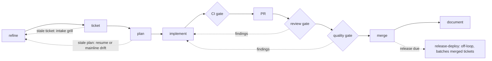

# app-sdlc

> Replaces a pile of loosely-connected, install-and-forget skills with a single orchestrated
> lifecycle that wires each stage to the right discipline and binds to *your* actual tools and
> workflow instead of assuming a fixed stack.

`app-sdlc` is a tool-agnostic **software-development-lifecycle orchestrator** for
[Claude Code](https://claude.com/claude-code) — and any agent that reads `SKILL.md` skills.
This repo ships it two ways: as a Claude Code **plugin** (the repo doubles as its own plugin
marketplace) and as a plain skills repo installable with the
[`skills` CLI](https://github.com/vercel-labs/skills). It is the personal skills repo of
Ivo Pogace (each subdirectory of `skills/` is one skill), but today it is effectively one
thing: the [`app-sdlc`](skills/app-sdlc/SKILL.md) suite, which the rest of this README
describes.

## Quick start

From the root of the project that should adopt the lifecycle:

```bash
claude plugin marketplace add ivopogace/skills
claude plugin install app-sdlc@ivopogace-skills --scope project
```

or, for any agent via the skills CLI (prompts for user vs. project scope):

```bash
npx skills add ivopogace/skills
```

Then ask Claude to **"adopt app-sdlc"** — the onboarding interview binds the tooling map to
your repo. Details and team setup in [Installing](#installing).

## What makes it different

`app-sdlc` is the *conductor*, not the instruments: the wiring that sequences the lifecycle,
closes the loop, and binds to **your** tools.

- **Orchestrator, not a pile.** The hard, unsolved part isn't having a handful of good skills
  — it's the connective tissue: which discipline drives each stage, how a review finding gets
  back into code, what "done" means. `app-sdlc` is *one orchestrator + six stage references*
  that encode the loop itself, not another flat collection of standalone skills.
- **It binds to your stack — it doesn't assume one.** A **13-slot tooling map** and an
  onboarding interview bind every `<TOKEN>` (`<VCS>`, `<CI>`, `<TRACKER>`, …) to whatever you
  actually use — Jira + Jenkins + GitLab + SonarQube + Confluence, or GitHub-native
  everything. Same discipline, your tools.
- **It grows on first contact.** Nothing is dumped on day one. The suite ships only the loop,
  gates, and disciplines; area skills grow **one at a time from real work**, each a deliberate
  *discover → map / extend / create* decision. You end up knowing exactly what's in your setup
  and why.
- **The loop actually closes.** The signature **re-entry rule** — *a fix is a change; it
  re-enters at Implement* (routing gate, test-first, re-review) regardless of size — is the
  hardest discipline to hold and the easiest to drop.
- **It composes with what you already have.** The routing gate's *discover-before-create* step
  maps an area to an existing skill when one fits — global, plugin, or another project —
  rather than blindly forking a new one.

---

## The lifecycle in one picture



**Solid = the path every ticket takes; dotted = conditional feedback.** The **stale-intent
edges** fire when an existing **ticket** is stale (the intake-grill gate) *or* a **plan** is
found stale on resume / after mainline drift — either sends you back to re-refinement (fix
the intent, update the ticket/spec) before more planning or code; fresh, well-formed work
flows straight through. Review/quality **findings re-enter at Implement** only when there
are findings. **release-deploy** sits off the loop: a runbook invoked when a release is
due, batching the tickets merged since the last one.

Every tool in the diagram is a slot in the **13-slot tooling map** (`<VCS>`, `<CI>`,
`<TRACKER>`, `<QUALITY>`, `<DOCS>`, `<MIGRATIONS>`, `<DEPLOY>`, `<DESIGN>`, `<AREAS>`,
`<NOTIFY>`, `<TESTS>`, `<E2E>`, `<REGISTRY>`), bound to a concrete tool by the onboarding
interview that fills the map from repo evidence + human decisions.

## The stages

| Stage | What happens |
|---|---|
| **Refine** | Sharpen a fuzzy idea into a precise, sliceable change, grounded in the code. Produces the **spec** — the committed statement of intent ("source-of-intent") that governs the change. |
| **Ticket** | Create/update the tracker ticket with testable acceptance criteria; branch `feature/<ID>-<slug>`. |
| **Plan** | Plan doc: testable ACs, risk register, open questions. Phase decomposition is **human-gated**. Existing ticket → **intake-grill gate** first. |
| **Implement** | Build **test-first**, one behavior at a time, under the **skill-routing gate**. |
| **CI gate** | Builds per push; "green" is whatever the tooling map records as the definition — passing result **plus** zero hidden failed tests. |
| **PR → Review → Quality gate → Merge** | Three mandatory gates before merge — see [the three non-negotiable gates](#the-three-non-negotiable-gates). |
| **Document** | Ticket documentation, unconditionally — part of every ticket's definition of done. |

## The three non-negotiable gates

1. **CI gate** — runs per push, not per PR. Red → systematic debugging, not guess-and-push.
2. **Review gate** — a mandatory review of the full branch diff, effort scaled by risk
   class. "PR opened + CI green" is the trap, not the finish line. (`<QUALITY>`=none → the
   review gate explicitly absorbs the quality duty.)
3. **Quality gate** — a green gate is *necessary, not sufficient*: pull the actual
   new-issue list and clear every entry.

**Findings re-enter the loop at Implement** — the re-entry rule. A fix (review finding,
quality finding, red-CI fix, later reviewer comment) is a change: routing gate first,
test-first, CI green again, and the changed surface **re-reviewed**. Being small or arriving
after a green build is not an exemption.

## Cross-cutting disciplines

- **The spec is universal.** Every change gets a spec (source-of-intent), always committed
  before the work it governs — length flexes with size, existence does not. Only spikes
  are exempt.
- **Skill-routing gate.** Before writing for an area, load that area's skill first. When a
  row has no project skill yet, **discover before you create**: search existing skills
  (global / plugin / other projects) and let the human choose **map / extend / create** —
  never a silent fork.
- **Grow on first contact.** The suite ships the loop, gates, and stage disciplines; the
  project-specific stage drivers and area skills grow one at a time, triggered by real work
  — never stubbed up front.
- **Source-of-intent lives in the repo**, not the conversation. Specs and plans are
  committed before or with the artifacts that cite them.
- **Documentation is part of done** — unconditionally.

## When *not* to use it

Trivial fixes (still a few-sentence spec), spikes/exploration (no spec — no fixed intent
yet), and hotfixes take lighter paths. The full ceremony is for real, sliceable change.

## Suite structure

| File | Role |
|---|---|
| [`skills/app-sdlc/SKILL.md`](skills/app-sdlc/SKILL.md) | The orchestrator: tooling map, the loop, the rules, the skill-routing gate. |
| [`references/onboarding-interview.md`](skills/app-sdlc/references/onboarding-interview.md) | First act — fill the tooling map from repo evidence. |
| [`references/stage-disciplines.md`](skills/app-sdlc/references/stage-disciplines.md) | The tool-independent core of each stage (read per stage). |
| [`references/ticket-intake-gate.md`](skills/app-sdlc/references/ticket-intake-gate.md) | Grill an existing ticket against today's code before planning. |
| [`references/pr-gates.md`](skills/app-sdlc/references/pr-gates.md) | Review gate → quality gate → merge close-out + definition of done. |
| [`references/release-deploy.md`](skills/app-sdlc/references/release-deploy.md) | Off-loop batched-release runbook (human-gated). |
| [`references/growing-area-skills.md`](skills/app-sdlc/references/growing-area-skills.md) | How stage-driver and area skills grow, and the discover-before-create rule. |

`app-sdlc` is a **template**: the generalized skeleton lifted from a concrete, fully
project-bound SDLC suite. What you install carries the loop, gates, and stage disciplines,
but no project-specific tools or area skills — every `<TOKEN>` stays a placeholder until
you **adopt it per project**: the onboarding interview fills the 13-slot tooling map from
repo evidence, seeds the routing table, and grows the project's own skills on first
contact. The copy here stays tool-agnostic while each project carries its own bound
instance.

## Installing

Requires a Claude Code recent enough to have plugin marketplaces (`/plugin`), or any agent
supported by the [`skills` CLI](https://github.com/vercel-labs/skills). Either way you are
installing the **template** — nothing runs against real tools until you
[adopt it per project](#adopt-per-project).

### As a Claude Code plugin (recommended)

The repo is its own plugin marketplace. Since `app-sdlc` binds per project, install it at
**project scope**, from the root of the adopting project:

```bash
claude plugin marketplace add ivopogace/skills
claude plugin install app-sdlc@ivopogace-skills --scope project
```

To share it with the repo's collaborators:

1. The install above writes `"enabledPlugins": { "app-sdlc@ivopogace-skills": true }`
   into the repo's `.claude/settings.json`.
2. Add the marketplace source to the same file — the install records only the plugin,
   not where to fetch it from:

   ```json
   {
     "extraKnownMarketplaces": {
       "ivopogace-skills": {
         "source": { "source": "github", "repo": "ivopogace/skills" }
       }
     },
     "enabledPlugins": { "app-sdlc@ivopogace-skills": true }
   }
   ```

3. Commit `.claude/settings.json`. Anyone who trusts the folder is then prompted to
   install the plugin.

Prefer a personal install across all your projects? Use `--scope user`, or run
`/plugin install app-sdlc@ivopogace-skills` inside Claude Code, which asks for a scope
interactively (user / project / local). Once installed, the skill is available as
`app-sdlc:app-sdlc` and triggers automatically from its description.

### With the skills CLI (any agent)

The [`skills` CLI](https://github.com/vercel-labs/skills) installs plain copies of the
skill into whatever agents you use (Claude Code, Cursor, Codex, …) and prompts for
**user or project scope**:

```bash
npx skills add ivopogace/skills
```

This copies `skills/app-sdlc/` (the `SKILL.md` plus its `references/`) into the agent's
skills directory — e.g. `.claude/skills/app-sdlc` (project) or `~/.claude/skills/app-sdlc`
(user). The same layout can be copied by hand if you prefer.

### Updating

- Plugin: `claude plugin marketplace update ivopogace-skills` — the plugin carries no
  pinned version, so every push to `main` is an update.
- skills CLI: `npx skills update`.

### Adopt per project

Run the onboarding interview (see
[`references/onboarding-interview.md`](skills/app-sdlc/references/onboarding-interview.md))
in the target project to bind the template to that repo — this is the suite's first act,
and `app-sdlc` will insist on it before driving any stage whose tooling slot is unbound.

## License

Released under the [MIT License](LICENSE).
